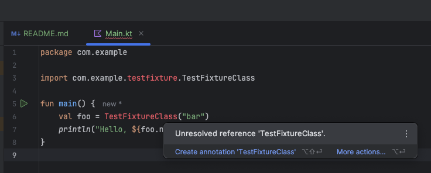

This example shows problems with `IntelliJ IDEA 2025.1 (Ultimate Edition)` Kotlin K2 mode enabled.

This compiles and runs normally with `./gradlew run` but IDEA shows errors in the editor
in file `uses-test-fixture-in-main/src/main/kotlin/com/example/Main.kt`.

Note that we are using testFixtures in the main classpath of the `uses-test-fixture-in-main`. There
are cases where such is needed. For example, in testdata service, which is deployed in development environments.

The corresponding bug is tracked in this [issue](https://youtrack.jetbrains.com/issue/IDEA-371104).
